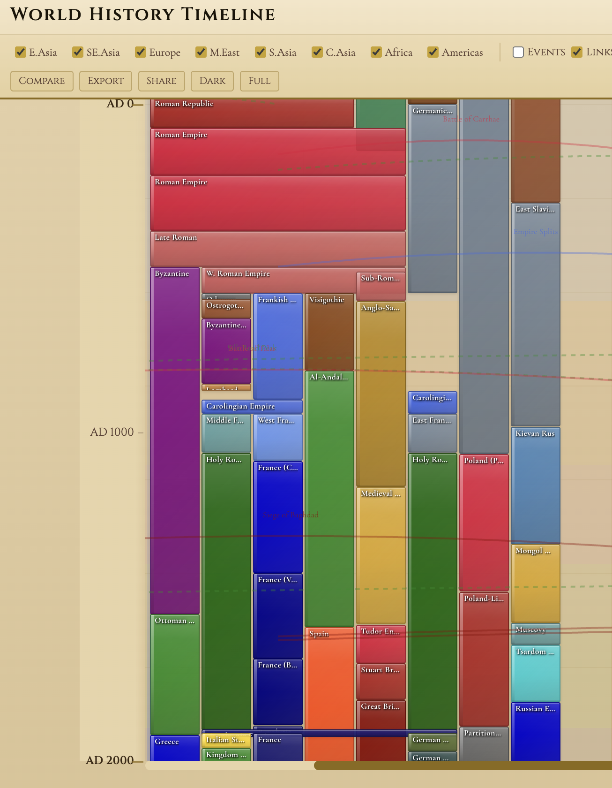

# World History Timeline

An interactive visualization of world history from 3000 BC to 2000 AD, spanning 8 major regions across 5000 years of human civilization.

<p align="center">
  
</p>

> To add a screenshot: Open `index.html` in browser, take a screenshot, save as `assets/screenshot.png`

## Features

- **8 Regions**: East Asia, Southeast Asia, Europe, Middle East, South Asia, Central Asia, Africa, Americas
- **5000 Years**: From the Bronze Age to the Modern Era
- **Bilingual**: English and Chinese language support
- **Interactive**: Click any dynasty/civilization for details and Wikipedia links
- **Connection Lines**: Visualize trade routes, conflicts, and cultural exchanges
- **Historical Events**: Major world events marked on the timeline

## Controls

| Feature | Description |
|---------|-------------|
| **Zoom** | Use slider or +/- buttons to zoom in/out |
| **Jump to Year** | Enter any year (e.g., "500", "1066 AD", "500 BC") |
| **Era Buttons** | Quick jump to Bronze, Classical, Medieval, or Modern era |
| **Search** | Find dynasties by name |
| **Region Filter** | Show/hide specific regions |
| **Dark Mode** | Toggle dark theme |
| **Full Page** | Distraction-free viewing mode (Esc to exit) |
| **Compare** | Compare two regions side by side |
| **Export** | Save as image |
| **Share** | Copy shareable URL with current view state |

## Keyboard Shortcuts

- `Ctrl/Cmd + +` : Zoom in
- `Ctrl/Cmd + -` : Zoom out
- `Ctrl/Cmd + 0` : Reset zoom
- `Escape` : Close panels / Exit full page mode

## Quick Start

Simply open `index.html` in a modern web browser. No build process or server required.

```bash
# Clone and open
git clone <repo-url>
cd History_Visual
open index.html  # macOS
# or
start index.html  # Windows
# or
xdg-open index.html  # Linux
```

## File Structure

```
History_Visual/
├── index.html      # Main HTML structure
├── styles.css      # Styling and themes
├── print.css       # Print-specific styles
├── app.js          # Application logic and data
├── assets/         # Screenshots and images
└── README.md       # This file
```

## Data Sources

Historical data compiled from various academic sources. Wikipedia links provided for further reading.

## Disclaimer

This timeline is for educational purposes only. The representation of borders, territories, and political entities reflects historical contexts and does not imply any political stance or endorsement. Some historical interpretations may vary among scholars.

## License

MIT License
